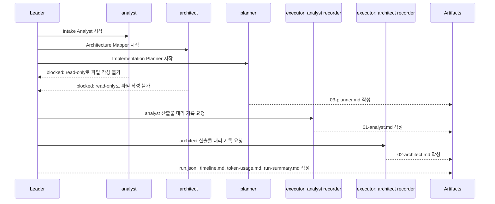

# KTD-9 run-001 타임라인

## 요약

- Run ID: `KTD-9-run-001`
- 이슈: `KTD-9`
- 시작 관측 시각: `2026-05-11T13:17:32Z`
- 종료 관측 시각: `2026-05-11T13:21:43Z`
- 상태: `completed_with_fallbacks`
- 주의: 종료 시각은 Codex App subagent API가 직접 제공한 값이 아니라 leader가 관측한 상한 시각이다.

## Swimlane

## 이벤트 표

| 순서 | Agent | 표시 이름 | 시작 | 종료 관측 상한 | 상태 | 결과 |
|---:|---|---|---|---|---|---|
| 1 | `analyst` | Intake Analyst | `13:17:32Z` | `13:19:25Z` 이전 | blocked | read-only 제약으로 파일 작성 실패 |
| 2 | `architect` | Architecture Mapper | `13:17:32Z` | `13:19:25Z` 이전 | blocked | read-only 제약으로 파일 작성 실패 |
| 3 | `planner` | Implementation Planner | `13:17:32Z` | `13:19:25Z` 이전 | completed | `03-planner.md` 작성 |
| 4 | `executor` | Analyst Artifact Recorder | `13:19:25Z` | `13:21:43Z` 이전 | completed | `01-analyst.md` 대리 기록 |
| 5 | `executor` | Architect Artifact Recorder | `13:19:25Z` | `13:21:43Z` 이전 | completed | `02-architect.md` 대리 기록 |

