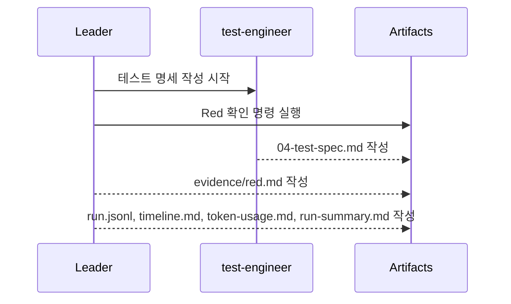

# KTD-9 run-002 타임라인

## 요약

- Run ID: `KTD-9-run-002`
- 이슈: `KTD-9`
- 시작 관측 시각: `2026-05-11T13:29:49Z`
- 종료 관측 시각: `2026-05-11T13:32:23Z`
- 상태: `completed`
- 범위: 테스트 명세 작성과 Red 실패 증거 수집

## 흐름

## 이벤트 표

| 순서 | 단계 | 담당 | 시작 | 종료 관측 상한 | 상태 | 결과 |
|---:|---|---|---|---|---|---|
| 1 | 테스트 명세 | `test-engineer` | `13:29:49Z` | `13:32:23Z` 이전 | completed | `04-test-spec.md` 작성 |
| 2 | Red 실패 증거 | leader | `13:29:49Z` | `13:32:23Z` 이전 | completed | `evidence/red.md` 작성 |

## Red 판정

- `backend/` 없음: backend build/test 실행 불가
- `frontend/` 없음: frontend build/test 실행 불가
- Java 21 LTS 없음: 기본 `java`는 8, Maven은 25 사용
- Node와 pnpm은 사용 가능

