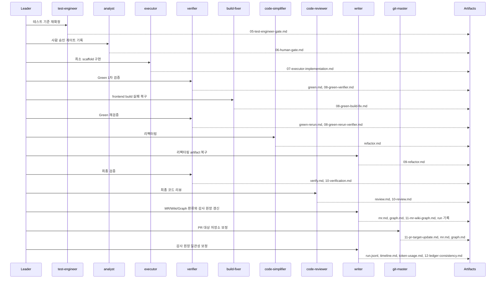

# KTD-9 run-003 타임라인

## 요약

- Run ID: `KTD-9-run-003`
- 이슈: `KTD-9`
- 관측 기준일: `2026-05-11`
- 상태: `completed`
- 범위: 사람 승인 게이트, 최소 scaffold 구현, Green/리팩터링/최종 검증/리뷰, MR/Wiki/Graph 환류, PR 대상 저장소 보정

## 흐름

## 이벤트 표

| 순서 | 단계 | 담당 | 상태 | 주요 결과 |
|---:|---|---|---|---|
| 1 | 테스트 기준 재확정 | `test-engineer` | completed | Java 21, backend test, frontend test/build 기준 유지 |
| 2 | 사람 승인 | `analyst` | completed | 사용자 승인 흐름과 subagent 필수 규칙 기록 |
| 3 | 최소 구현 | `executor` | completed | backend/frontend scaffold, README, `.gitignore` 추가 |
| 4 | Green 1차 검증 | `verifier` | completed | frontend build 실패로 Green 완료 불가 판정 |
| 5 | Green 실패 복구 | `build-fixer` | completed | CSS import 타입과 Vitest config 타입 오류 복구 |
| 6 | Green 재검증 | `verifier` | completed | backend local elevated test, frontend test/build PASS |
| 7 | 리팩터링 | `code-simplifier` -> `writer` | completed | Surefire argLine과 README sandbox 주석 보강, artifact 복구 |
| 8 | 최종 검증 | `verifier` | completed | 최종 PASS, sandbox backend test 제약 기록 |
| 9 | 최종 코드 리뷰 | `code-reviewer` | completed | APPROVE, 차단 이슈 없음 |
| 10 | MR/Wiki/Graph 환류 | `writer` | completed | MR 초안, graph 보류 사유, 전체 run 기록 작성 |
| 11 | PR 대상 저장소 보정 | `git-master` | completed | backend PR target `mahub-api`, frontend PR target `mahub-web` 반영 |
| 12 | 감사 원장 일관성 보정 | `writer` | completed | `run.jsonl`, `timeline.md`, `token-usage.md`에 `git-master` 단계 반영 |

## 최종 판정

run-003은 완료됐다. 실제 PR/MR 생성과 `/understand` graph 실행은 후속 단계로 남았다. PR 대상 저장소는 backend `mahub-api`, frontend `mahub-web`로 분리 반영됐다.
