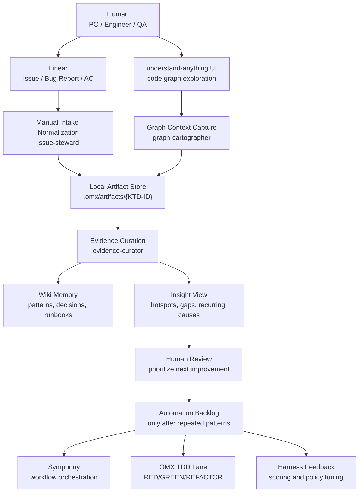
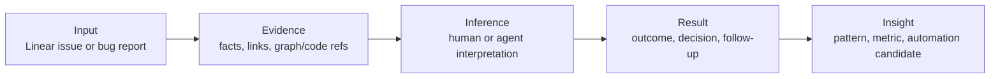

# AI Foundry MVP Plan

목표는 Linear issue를 기준으로 AIDD workflow/harness와 MA Hub 산출물을 연결하고, issue별 artifact와 graph context를 축적해 반복 패턴과 병목을 확인하는 것이다. 모든 작업은 Linear issue로 기록하며, `harness` 라벨은 Codex가 직접 PR까지 처리하고 `aidd`/`mahub` 코드 영역 작업은 Codex gate를 통과한 뒤 Symphony가 주관한다.

현재 준비된 것:

- Linear workspace: `https://linear.app/ktds-ai-eng/team/KTD/active`
- understand-anything graph UI: `http://127.0.0.1:5173/`
- 로컬 작업 저장소: `/Users/so2/workspace-so2/foundary`

## 1. MVP Architecture



The first loop is deliberately human-in-the-loop:

1. A person creates a Linear issue or bug report.
2. A person or read-only agent normalizes the intake.
3. A person uses understand-anything to inspect related code/domain context.
4. The graph context, evidence, decisions, and result are stored under the issue id.
5. The accumulated data is visualized for insight.
6. Only repeated, stable, low-risk steps become automation candidates.

## 2. Symphony 운영 기준

Symphony는 이제 `aidd`/`mahub` 코드 영역 작업을 주관하는 실행기로 둔다.

Codex는 모든 이슈를 먼저 intake gate로 확인한다. `harness` 라벨이면 Codex가 직접 PR과 완료 처리를 할 수 있고, `aidd`/`mahub` 라벨이면 문제, 범위, 인수 조건, 검증 기준, 산출물이 충분한지 확인한 뒤 `Symphony Ready`로 넘긴다.

Use this routing rule:

| Question | If yes | If no |
|---|---|---|
| Does the issue have a single fixed `harness` label? | Codex may create PR and complete it | Do not directly process as harness |
| Does the issue have a single fixed `aidd` or `mahub` label? | Codex checks intake, then moves it to `Symphony Ready` | Ask to fix the label first |
| Are issue template fields complete enough? | Symphony can take the issue | Ask for missing problem/scope/AC/verification/artifacts |
| Does the workflow start? | Symphony must leave at least one subagent activity | Treat missing subagent activity as an observability gap |

현재 기준은 루트 `README.md`를 우선한다.

## 3. Phased Plan

### Phase 0. Local Foundation

Purpose: create a small source of truth for planning, templates, and artifacts.

Deliverables:

- Local git repo
- This planning document
- `.gitignore` for local runtime state
- Linear issue/bug template draft
- Artifact folder schema
- Initial sub agent roster

Exit criteria:

- New issues can be represented as folders under `.omx/artifacts/{KTD-ID}`.
- The team knows which fields must be captured before analysis starts.

### Phase 1. Human Intake And Bug Report Discipline

Purpose: make human-entered Linear issues consistent enough to analyze later.

Required Linear fields:

- Type: `feature`, `bug`, `task`, `research`
- Problem statement
- Expected behavior
- Actual behavior, for bugs
- Reproduction steps, for bugs
- Evidence links: screenshots, logs, traces, user report, Slack thread
- Affected domain
- Severity and urgency
- Known workaround
- understand-anything graph link or note, if inspected

Exit criteria:

- Every meaningful bug has expected/actual/repro/evidence.
- Every meaningful issue has an affected domain and owner.

### Phase 2. Graph Context Capture

Purpose: use understand-anything as the code/domain context map, not as an automatic decision engine.

Capture per issue:

- Graph URL or screenshot
- Related files
- Related symbols/components
- Suspected domain boundary
- Upstream/downstream dependencies
- Unknowns that the graph did not answer

Exit criteria:

- Issues can be grouped by file, symbol, domain, and dependency path.
- Evidence distinguishes direct graph/code facts from human inference.

### Phase 3. Evidence And Wiki Memory

Purpose: preserve what was learned, even when no automation runs.

Per issue artifact bundle:

```text
.omx/artifacts/KTD-123/
  raw-linear.md
  00-intake.md
  bug-report.md
  graph-context.md
  evidence.md
  human-notes.md
  result.md
  insight-summary.md
```

Wiki memory categories:

- recurring bug pattern
- fragile module
- missing test area
- confusing ownership boundary
- repeated manual workflow
- decision or rejected option

Exit criteria:

- A later agent or human can understand why a decision was made without reopening the whole conversation.

### Phase 4. Insight Visualization

Purpose: turn accumulated issue artifacts into operational insight.

First visualizations:

- Issues by affected domain
- Bugs by related file/symbol
- Missing reproduction steps by reporter/source
- Evidence quality by issue type
- Repeated root cause cluster
- Manual steps repeated often enough to automate
- Test gaps by domain
- Time from Linear intake to result note

Exit criteria:

- The team can identify the top 3 automation candidates from observed data, not guesswork.

### Phase 5. Read-Only Automation

Purpose: automate only stable, low-risk analysis chores.

Candidate automations:

- Create artifact folder from Linear id
- Generate `00-intake.md` from Linear fields
- Normalize bug reports into expected/actual/repro/evidence
- Suggest graph context checklist
- Summarize issue outcome into `result.md`
- Update insight dashboard data

Exit criteria:

- Read-only automations save time without changing code or workflow state.

### Phase 6. Symphony And OMX Automation

Purpose: expand orchestration after the intake and evidence flow proves repeatable.

Expand Symphony when:

- The artifact schema has stabilized.
- Linear templates are consistently used.
- The same handoff sequence happens repeatedly.
- Manual state tracking becomes the bottleneck.

Add OMX TDD lane when:

- The team wants agent-assisted implementation.
- Test-first criteria are explicit.
- Regression targets are known.
- MR and review gates are ready.

## 4. Initial Sub Agent Roster

These agents are mostly read-only. They are roles first, not necessarily installed processes.

| Role | Purpose | Suggested agent style | Permission | Output |
|---|---|---|---|---|
| `issue-steward` | Normalize human Linear issue into a usable intake record | product-manager, business-analyst, scrum-master | read-only | `00-intake.md` |
| `bug-report-normalizer` | Structure bug reports into expected/actual/repro/evidence | debugger, error-detective, qa-expert | read-only | `bug-report.md` |
| `graph-cartographer` | Capture related graph nodes, files, symbols, boundaries | code-mapper, search-specialist | read-only | `graph-context.md` |
| `evidence-curator` | Separate evidence, inference, unknowns, and decisions | knowledge-synthesizer, research-analyst | read-only | `evidence.md` |
| `wiki-curator` | Promote durable lessons and decisions into wiki memory | technical-writer, documentation-engineer | docs-write | wiki note |
| `insight-analyst` | Aggregate issue artifacts into trends and automation candidates | product-analyst, knowledge-synthesizer | read-only | `insight-summary.md` |

Deferred agents:

| Deferred role | Why deferred |
|---|---|
| `tdd-developer` | Code-writing automation should wait until intake, evidence, and test targets are stable. |
| `debug-fixer` | Fix execution should wait until bug reports and graph context are consistent. |
| `release-engineer` | Deployment automation is downstream of MR and CI readiness. |
| `e2e-scenario-owner` | E2E scenario management matters later, but first we need recurring user-flow evidence. |
| `harness-policy-tuner` | Harness feedback needs enough historical issue/result data to score. |

## 5. Agent Contract

Every agent or human-assisted step should use the same evidence boundary.



Minimal issue artifact schema:

```yaml
issue_artifact:
  issue_id: "KTD-123"
  linear_url: "https://linear.app/ktds-ai-eng/issue/KTD-123/..."
  type: "bug"
  status: "observed"
  affected_domain: "unknown"
  graph_context:
    ui_url: "http://127.0.0.1:5173/"
    related_files: []
    related_symbols: []
    unknowns: []
  evidence:
    direct:
      - source: "Linear description"
        claim: "User reports failure after login"
    inferred:
      - claim: "Likely auth/session boundary"
        confidence: "low"
    missing:
      - "No screenshot attached"
      - "No reproduction account"
  result:
    disposition: "triaged"
    decision: ""
    follow_up: []
  insight_tags:
    - "needs-repro"
```

## 6. Linear Templates

### Feature / Task Intake

```markdown
## Goal

## User / Stakeholder

## Acceptance Criteria

## Affected Domain

## Evidence / Links

## Graph Context

## Non-goals

## Risks / Unknowns
```

### Bug Report Intake

```markdown
## Summary

## Expected Behavior

## Actual Behavior

## Reproduction Steps

## Environment

## Evidence
- Screenshot:
- Logs:
- Trace:
- User report:

## Affected Domain

## Graph Context

## Workaround

## Unknowns
```

## 7. Insight Dashboard Data Model

Start with a simple issue summary table before building a custom dashboard.

| Field | Source | Why it matters |
|---|---|---|
| `issue_id` | Linear | Join key |
| `issue_type` | Linear | Feature vs bug pattern |
| `severity` | Linear | Prioritization |
| `affected_domain` | Intake | Hotspot grouping |
| `related_files` | Graph context | Code hotspot grouping |
| `related_symbols` | Graph context | Ownership and dependency insight |
| `has_repro_steps` | Bug report | Bug report quality |
| `has_evidence` | Bug report | Triage quality |
| `evidence_quality` | Evidence curator | Confidence trend |
| `result_disposition` | Result note | Outcome tracking |
| `manual_steps_repeated` | Human notes | Automation candidate |

## 8. Automation Backlog Rule

Do not automate a step just because it is possible. Automate when all are true:

- The step has happened at least several times.
- Inputs and outputs are stable.
- Failure is easy to detect.
- The automation can run read-only or has a tight write scope.
- A human can review the output quickly.

Recommended first automations:

1. Linear issue to artifact folder skeleton.
2. Bug report completeness check.
3. Graph context checklist generator.
4. Evidence vs inference formatter.
5. Insight summary table generator.

Symphony can orchestrate these after the contracts are clear enough for repeatable execution.

## 9. Immediate Next Steps

1. Keep the README as the first source of truth for label routing and local run commands.
2. Use Linear labels to split `harness` and `aidd`/`mahub` work before processing.
3. Move only intake-complete `aidd`/`mahub` issues to `Symphony Ready`.
4. Store issue-local workflow evidence under `.omx/artifacts/{KTD-ID}/run-*`.
5. Capture graph context from understand-anything when it helps explain scope or impact.
6. Build insight summaries from repeated issue, artifact, PR, and graph patterns.

## 10. Long-Term Direction

The earlier full architecture still matters, but it is a later layer:

- Symphony: orchestrates repeated handoffs after intake and evidence patterns stabilize.
- OMX TDD: runs test-first implementation after issue/test contracts are clear.
- E2E scenario owner: manages smoke/full/quarantine after user-flow bugs are consistently captured.
- Harness feedback: scores agent behavior after there is enough historical issue/result data.
- Optional GraphDB: only if Linear links plus local artifacts plus understand-anything snapshots become too slow or weak for cross-issue queries.
